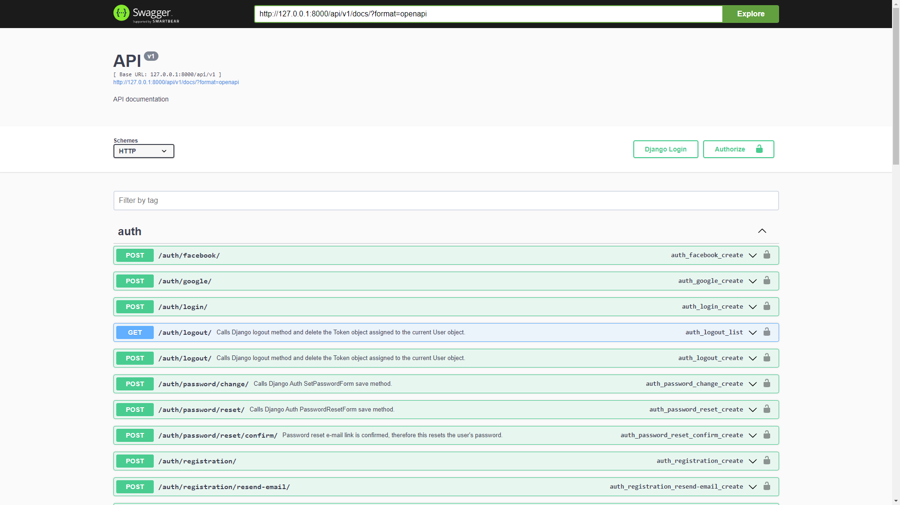
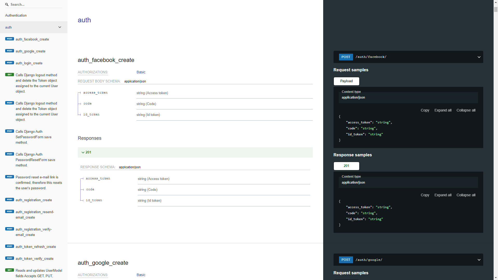
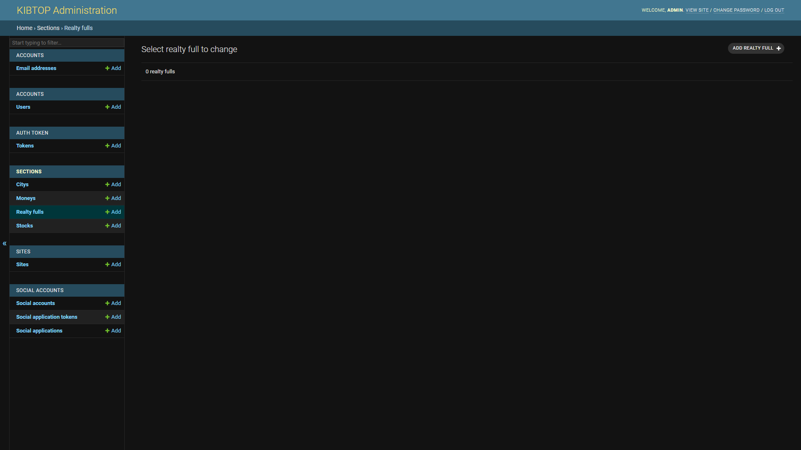
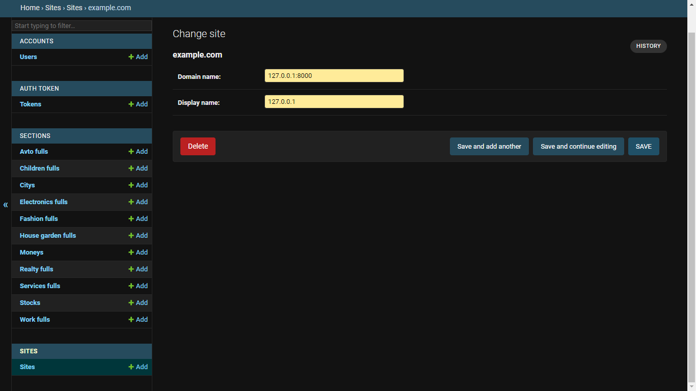

# Сonfiguration API
Сreate file **.env** path **services/backend** \
Full path - **services/backend/.env**
```
# WEB SITE SETTINGS
SECRET_KEY=
POSTGRES_HOST=
POSTGRES_DB=
POSTGRES_USER=
POSTGRES_PASSWORD=
POSTGRES_PORT=

# SOCIAL SETTINGS
URL=
SOCIAL_SECRET=
GOOGLE_CLIENT_ID=
GOOGLE_CLIENT_SECRET=

# EMAIL CREDENTIALS
EMAIL_HOST=
EMAIL_PORT=
EMAIL_HOST_USER=
EMAIL_HOST_PASSWORD=
```

# Launching API

```
cd services/backend
docker compose up --build
```

**Api links:** 

Swagger - http://127.0.0.1:8000/api/v1/docs/ 



Redoc - http://127.0.0.1:8000/api/v1/docs/redoc/



**Admin link** \
Django Admin - http://127.0.0.1:8000/admin/


**Creating Admin user**
```
docker ps
```
```
# Сonclusion ...
<id container react>    frontend-react  "docker-entrypoint.s…"   1 minutes ago   Up 1 minutes   0.0.0.0:3000->3000/tcp   react
<id container postgres> postgres        "docker-entrypoint.s…"   1 minutes ago   Up 1 minutes   0.0.0.0:5432->5432/tcp   backend-postgresql-1
<id container api>      backend-api     "sh -c ' python mana…"   1 minutes ago   Up 1 minutes   0.0.0.0:8000->8000/tcp   api
```
```
docker exec -ti <id container api> python manage.py createsuperuser
```
```
# Сonclusion ...
Username: admin # The input is displayed (user by default 'admin')
Email: admin@admin.com # The input is displayed (email by default 'admin@admin.com')
Password: # The input is not displayed (default password is '1234')
Password (again): # The input is not displayed (default password is '1234')
This password is too short. It must contain at least 8 characters.
This password is too common.
This password is entirely numeric.
Bypass password validation and create user anyway? [y/N]: y # <- Important 
Superuser created successfully.

```

# Сonfiguration API Admin
**Change sites**



# Launching React

```
cd services/frontend
docker compose up --build
```

**React link** - http://127.0.0.1:3000/

# Настройте репозиторий
Обновите индекс ```apt``` пакета и установите пакеты, чтобы разрешить ```apt``` использование репозитория по протоколу HTTPS:
```
apt-get update
```
```
apt-get install -y \
  ca-certificates \
  curl \
  gnupg \
  lsb-release
```
Добавьте официальный GPG-ключ Docker:
```
mkdir -p /etc/apt/keyrings
```
```
curl -fsSL https://download.docker.com/linux/debian/gpg | gpg --dearmor -o /etc/apt/keyrings/docker.gpg
```
Используйте следующую команду для настройки репозитория:
```
echo \
  "deb [arch=$(dpkg --print-architecture) signed-by=/etc/apt/keyrings/docker.gpg] https://download.docker.com/linux/debian \
  $(lsb_release -cs) stable" | tee /etc/apt/sources.list.d/docker.list > /dev/null
```
# Установить движок Docker
Обновите индекс ```apt``` пакета и установите последнюю версию Docker Engine, containerd и Docker Compose или перейдите к следующему шагу, чтобы установить конкретную версию:
```
apt-get update
```
Установите Docker Engine
```
apt-get install -y docker-ce docker-ce-cli containerd.io docker-compose-plugin
```
